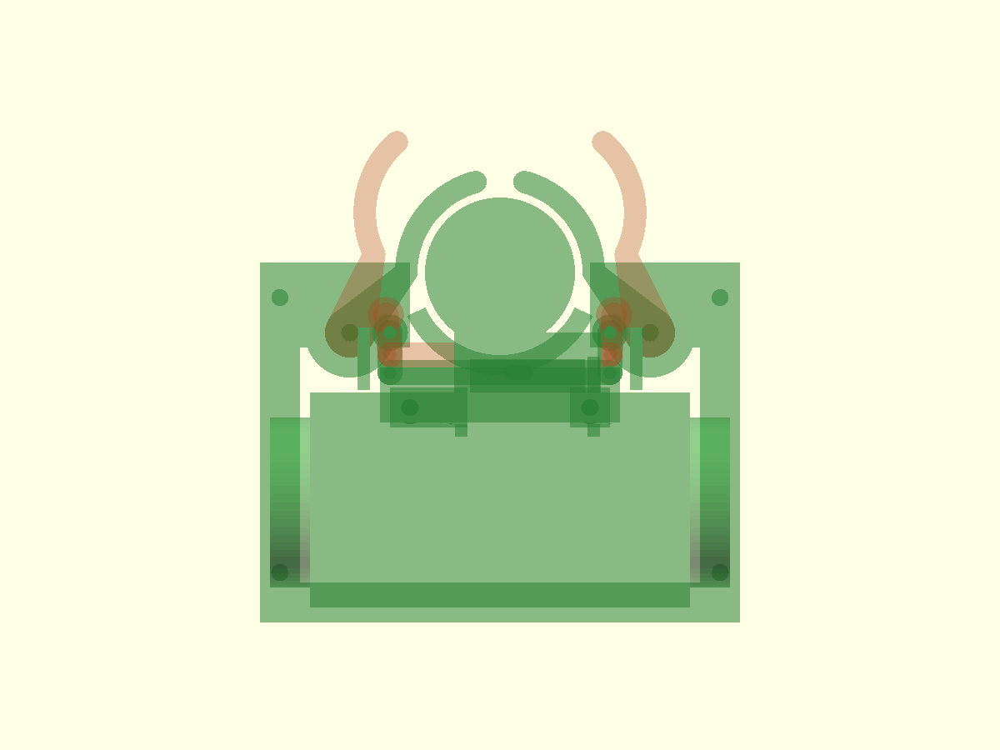

# 비버 로봇 v0.1 CAD

햄스터 로봇의 4점 장착 패턴을 이어받은, 바닥 접촉식 환자 실린더 운반 기구의 첫 CAD 초안이다. 외관보다 Ø30 × 20 mm 원통의 포획, 대칭 작동, 출력·조립 가능성을 우선했다. 비버 얼굴 장식은 포함하지 않았다.

> 이 버전은 명목 CAD 검증을 통과한 **기구 프로토타입**이다. 실물 서보·혼·바퀴·섀시를 장착한 포획, 충격, 마모, 토크, 전복 시험은 아직 하지 않았다. 대형 출력 전에 작은 가동부부터 시험한다.

## 선택한 링크 메커니즘

최종 구조는 **서보 1개 + 중앙 크랭크 + 횡방향 슬롯이 있는 전후 슬라이더 요크 + 동일 링크 2개 + 좌우 대칭 C형 집게**다.

- 단순 중앙 크랭크에 링크 2개를 직접 연결하면 크랭크 회전 중 좌우가 완전한 거울 대칭을 유지하기 어렵다.
- 출력 기어는 대칭성은 좋지만 백래시, 치형 출력 오차, 부품 수가 증가한다.
- 전후 요크는 좌우 링크 축을 같은 Y만큼 이동시키므로 대칭 운동이 구조적으로 정해진다.
- 서보 혼의 핀은 요크의 짧은 횡방향 슬롯을 밀어 크랭크의 작은 X 변위를 흡수하고 Y 변위만 전달한다.
- 링크 2개는 완전히 동일한 부품이므로 출력과 예비품 관리가 쉽다.

서보 총 명령 범위는 명목 약 **52.66°**, 요크 이동량은 **3.548 mm**다. 서보 크랭크 반경은 4 mm다. 실제 혼에서 4 mm 반경 핀을 만들 수 있는지 먼저 확인한다.

## 작동

1. **OPEN:** 요크가 전방으로 이동하고 두 링크가 C형 집게를 각각 바깥쪽으로 26° 회전시킨다.
2. **APPROACH/GUIDE:** 로봇이 전진한다. OPEN 입구는 38.243 mm이며 Ø30 원통에 대해 중심 오차를 좌우 약 4.12 mm까지 받아들이는 명목 여유가 있다. 더 큰 오차에서는 곡면과 의도적으로 접촉하며 중앙으로 유도되어야 한다.
3. **CAPTURE:** 원통 중심은 `[0, 22]`에 위치하고 바닥에 계속 닿는다. 로봇 전단 한계보다 안쪽으로 받아 무게중심 악화를 줄였다.
4. **CLOSE:** 요크가 후방으로 이동하고 집게가 동시에 닫힌다. 원통을 누르는 대신 후방 고정 칼라와 좌우·전방 C형 집게가 탈출 경로를 막는다.
5. **RELEASE:** 집게를 열고 로봇이 후진하면 원통이 바닥에 남는다.

## 검증 치수

| 항목 | v0.1 결과 |
|---|---:|
| 환자 참조체 | Ø30 × 20 mm |
| CLOSE 포켓 내경 | Ø33 mm |
| 원통–집게 반경 방향 간극 | 1.50 mm/면 |
| 원통–후방 칼라 간극 | 1.50 mm |
| OPEN 상태 포획 위치에서 집게 간극 | 약 8.17 mm |
| OPEN 입구 폭 | 38.243 mm |
| CLOSE 전방 목 폭 | 8.541 mm — Ø30 원통 통과 불가 |
| 집게–후방 칼라 최소 작동 간격 | 2.678 mm |
| 집게 유효 구속 높이 | 15 mm, Z=3.6~18.6 |
| 링크 축간 거리 | 8 mm, OPEN/CLOSE 모두 동일 |
| 요크 이동량 | 3.548 mm |
| 서보 총 회전 | 52.656° |
| CLOSE 전체 외형 X×Y×Z | **96 × 90.311 × 48.5 mm** |
| OPEN 전체 외형 X×Y×Z | **96 × 98.288 × 48.5 mm** |
| 최악 조건 외형 X×Y×Z | **96 × 98.288 × 48.5 mm** |

원통 아래에는 바닥판이 없다. 집게와 후방 벽은 원통 높이 전체를 덮지 않고 중간 높이 15 mm만 구속하여 무게와 재료를 줄였다. 링크 평면은 원통 상단보다 0.5 mm 높고, 서보 몸체 하단은 4 mm 높다.

독립 검사에서 다음을 확인했다.

- 중앙으로 접근하는 Ø30 원통의 Y=50→22 mm 경로가 OPEN 집게·후방 칼라와 겹치지 않는다.
- CLOSE 원통과 집게/후방 칼라 사이에 약 1.5 mm 간극이 있다.
- 좌우 집게끼리, 집게와 후방 칼라끼리 OPEN/CLOSE에서 고체 중첩이 없다.
- 원통 바닥 투영과 장착 베이스가 겹치지 않아 원통이 경기장 바닥에 닿을 수 있다.
- 6종 STL, 실제 출력 수량 7개가 모두 watertight 단일 연결 형상이고 Z=0에 놓여 있다.
- OPEN/CLOSE 전체 기구가 100 × 100 × 100 mm 이내다.

세부 값과 파일 해시는 `verification_beaver_v0.1.json`에 있다.

## 축 위치

좌표계는 +Y가 전방, Z=0이 경기장 바닥이며 단위는 mm다.

- 오른쪽 집게 회전축: `[30, 10]`, 왼쪽: `[-30, 10]`, 모두 Z축 방향 M3 축
- CLOSE 집게 링크축: 오른쪽 `[22, 10]`, 왼쪽 `[-22, 10]`
- OPEN 집게 링크축: 오른쪽 약 `[22.81, 13.51]`, 왼쪽은 X 반전
- 요크 링크축: X=`±22`, CLOSE Y=`2.00`, OPEN Y=`5.548`
- 서보 출력축: 약 `[0, 3.774, 21.5]`
- 햄스터 장착 홀: X=`±44`, Y=`17/-38`, M3 명목 통공

## 출력 파일

`stl_print/`의 부품만 구조용 출력물이다.

| 파일 | 수량 | 크기 X×Y×Z mm | 참고 |
|---|---:|---|---|
| `01_mounting_base.stl` | 1 | 96 × 72 × 23.3 | 후방 포켓 벽·집게 축·요크 가이드 통합 |
| `02_jaw_left.stl` | 1 | 32.35 × 37.31 × 23 | 평평한 면이 베드 |
| `03_jaw_right.stl` | 1 | 32.35 × 37.31 × 23 | 왼쪽과 대칭 |
| `04_slider_yoke.stl` | 1 | 49 × 5 × 2.5 | 평평하게 출력 |
| `05_link_x2.stl` | **2** | 13 × 5 × 2.5 | 동일 링크를 2개 출력 |
| `06_servo_mount.stl` | 1 | 47.5 × 16 × 45.5 | 브림 권장, 요크 통과창 위에 국부 서포트 |

`reference/patient_cylinder_30x20_REFERENCE_ONLY.stl`은 간섭 확인용 참조체이며 로봇 조립 부품이 아니다. OpenSCAD의 `part` 값을 바꾸면 CLOSE/OPEN 조립 상태와 부품을 다시 내보낼 수 있다. 주요 여유는 `radial_clearance` 한 변수로 조정한다.

0.4 mm 노즐 기준 시작값은 레이어 0.2 mm, 벽 4줄, 상·하단 5층, 내부 채움 25~35%다. 집게와 링크는 인성이 있는 PLA+/PETG를 우선 검토한다. 재료와 프린터가 바뀌면 구멍·축 여유 시험을 다시 한다.

## 구매·조립 부품

- 실제 치수를 측정한 SG90급 마이크로 서보 1개와 호환 서보 혼 1개
- 집게 축용 M3 접시머리/낮은 머리 볼트 2개, 와셔와 잠금 너트
- 링크 관절용 M2.5 볼트 4개, 얇은 와셔/스페이서와 잠금 너트
- 서보 혼→요크 슬롯용 저마찰 M2/M2.5 크랭크 핀 1개
- 서보 마운트→베이스용 M3 볼트·너트 2세트
- 햄스터 베이스 장착용 M3 체결재 4세트

1. 베이스의 접시 홈 아래에서 M3 축 볼트를 넣고 좌우 집게를 끼운다. 와셔를 넣고 축방향 흔들림 약 0.2~0.3 mm를 남긴다.
2. 요크를 두 외측 가이드 사이에 놓는다. X방향 흔들림이 크지 않으면서 Y방향으로 3.55 mm 이상 부드럽게 움직여야 한다.
3. 동일 링크 2개를 요크와 집게 레버에 M2.5 축으로 연결한다. 너트를 조여 링크를 고정하지 않는다.
4. 서보 마운트를 베이스에 고정하고 서보 출력축이 명목 위치에 오도록 설치한다. 실제 서보 귀 위치가 다르면 OpenSCAD 파라미터와 마운트를 수정한다.
5. 서보 중립, 혼 반경 4 mm, 크랭크 핀 위치를 맞춘 뒤 핀을 요크 슬롯에 넣는다.
6. 전원을 넣기 전 손으로 OPEN/CLOSE 전 구간을 움직여 걸림, 나사 끝 간섭, 링크 들림을 확인한다.
7. 낮은 속도·낮은 토크 제한에서 서보 끝각을 조금씩 늘려 최종 OPEN/CLOSE를 보정한다.

## 무게중심 대책

- 환자 중심을 Y=22 mm까지 깊게 받아들였다.
- 환자를 들어 올리지 않으므로 환자 무게가 전방 구조물에 직접 실리지 않는다.
- 집게 축은 차체 가까운 Y=10 mm, 서보 축은 Y≈3.77 mm에 둔다.
- 서보를 집게 끝이 아닌 중앙에 배치했다.
- 집게는 필요한 26°만 열리고 둥근 집게 끝까지 포함한 OPEN 최대 전방점도 Y≈50.29 mm다.
- 후방 벽과 베이스를 통합하고 링크 길이를 8 mm로 줄여 부품 수와 전방 질량을 낮췄다.
- 출력 플라스틱은 명목 약 37.4 g(PLA 밀도 1.24 g/cm³ 가정)이다.

## 예상 문제와 v0.2 과제

- 요크 이동량이 3.55 mm로 짧아 출력 공차·먼지·휘어짐이 큰 비율의 손실을 만들 수 있다.
- 오버센터 잠금이 없어 후진 충격이 링크를 통해 서보에 전달된다.
- 혼 반경 4 mm의 실제 핀 제작과 서보 스플라인 규격이 미확정이다.
- M3 집게 축과 출력 구멍 사이의 마모·백래시가 누적될 수 있다.
- OPEN 입구의 명목 중심 오차 허용은 ±4.12 mm다. 더 큰 오차의 실제 자기정렬 성능은 시험이 필요하다.
- 얇은 C형 앞니가 층 방향 충격으로 갈라질 수 있다.
- 현재 구동계·전자부는 keep-out 참조 형상이며, 완성된 이동 섀시와 실물 무게중심은 아직 검증하지 않았다.

v0.2에서는 실제 서보·혼·모터·바퀴를 실측하고, 축 부싱 또는 금속 스페이서, 기계식 끝단 스토퍼, 요크 행정 확대, 저백래시/오버센터 잠금, 교체형 앞니, 실제 주행 중 포획·회전·후진·충격 시험을 반영한다.
